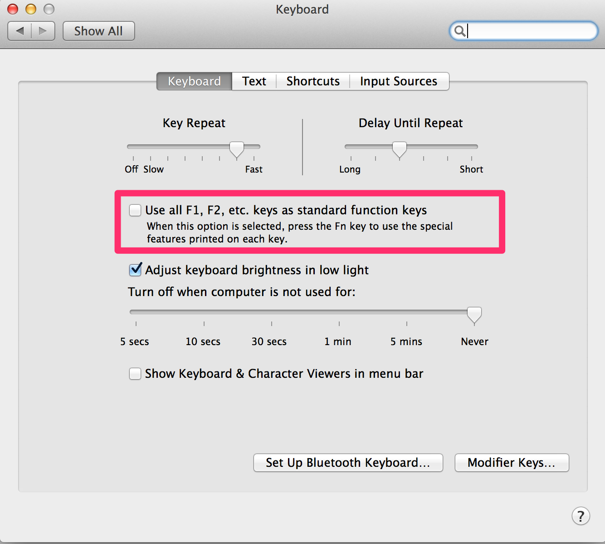
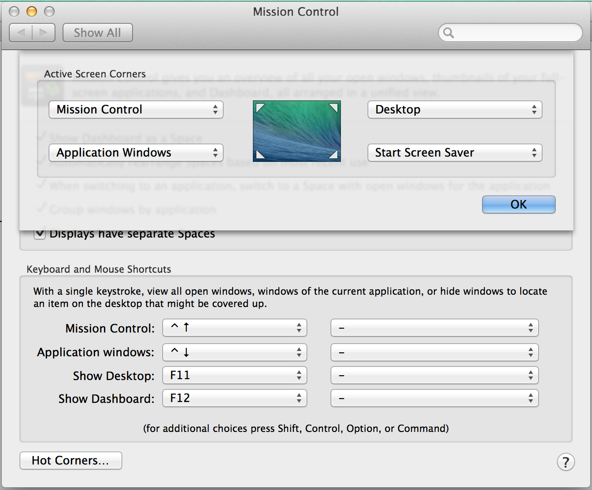
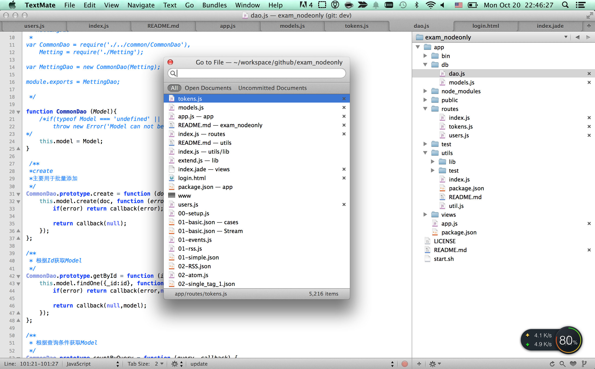
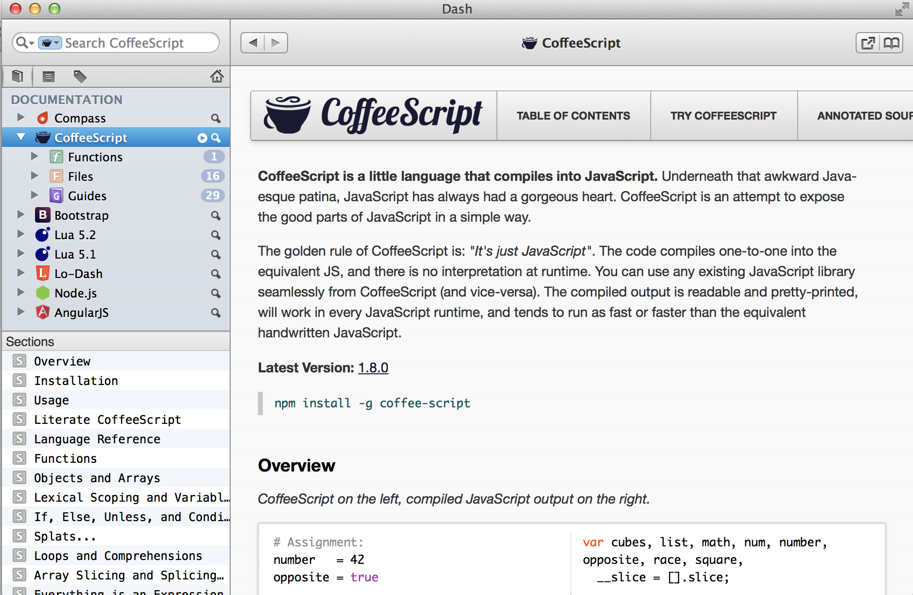
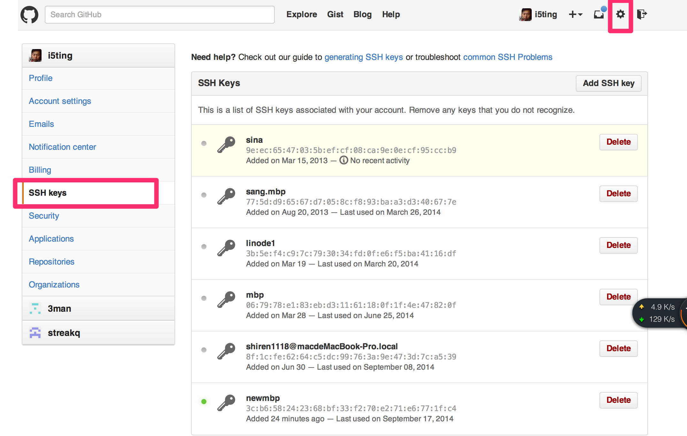
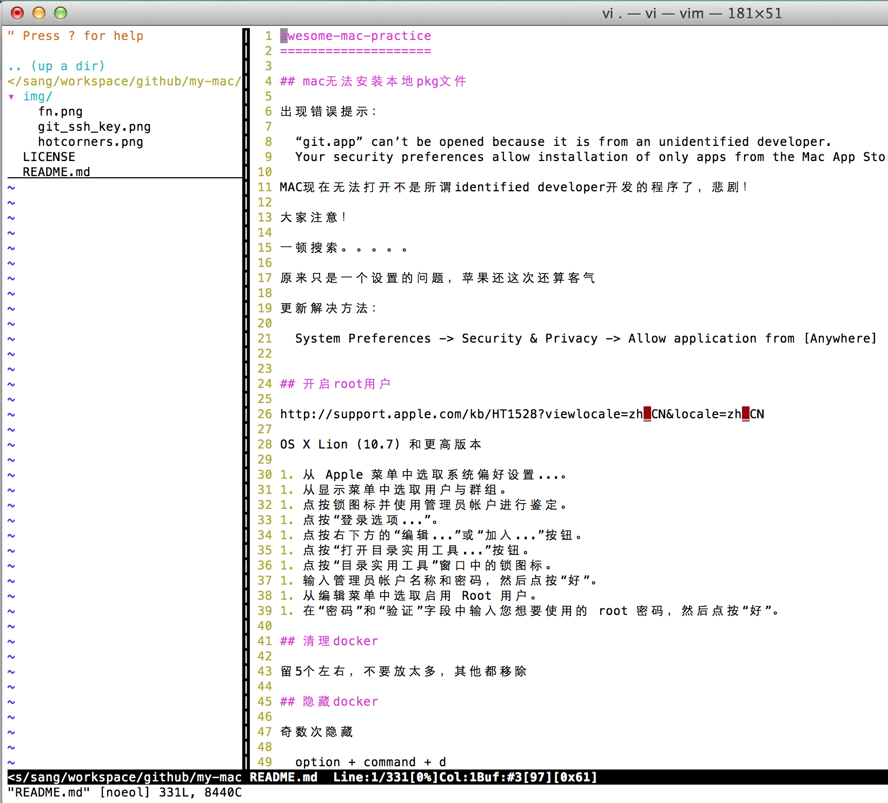

awesome-mac-practice
====================

## mac无法安装本地pkg文件

出现错误提示：

	“git.app” can’t be opened because it is from an unidentified developer.
	Your security preferences allow installation of only apps from the Mac App Store and identified developers.

MAC现在无法打开不是所谓identified developer开发的程序了，悲剧！

大家注意！

一顿搜索。。。。。

原来只是一个设置的问题，苹果还这次还算客气

更新解决方法：

	System Preferences -> Security & Privacy -> Allow application from [Anywhere]


## 开启root用户

http://support.apple.com/kb/HT1528?viewlocale=zh_CN&locale=zh_CN

OS X Lion (10.7) 和更高版本

1. 从 Apple 菜单中选取系统偏好设置...。
1. 从显示菜单中选取用户与群组。
1. 点按锁图标并使用管理员帐户进行鉴定。
1. 点按“登录选项...”。
1. 点按右下方的“编辑...”或“加入...”按钮。
1. 点按“打开目录实用工具...”按钮。
1. 点按“目录实用工具”窗口中的锁图标。
1. 输入管理员帐户名称和密码，然后点按“好”。
1. 从编辑菜单中选取启用 Root 用户。
1. 在“密码”和“验证”字段中输入您想要使用的 root 密码，然后点按“好”。

## 清理docker

iwork等应用你不会特别常用，而且用Spotlight或者quicksilver打开应用非常快，所以一定不要留不常用的

建议留5个左右，不要放太多，其他都移除

## 隐藏docker

奇数次隐藏

	option + command + d
	
偶数次即显示

## 启用fn功能键



## Trackpad

开启全部手势

## 触发角 

system preferences -> mission controll -> hot corners



- 左上：mission controll
- 左下：application windows
- 右上：desktop
- 右下：start screen saver

## 安装腾讯电脑管家

http://pc.qq.com/mac.html

[QQMacMgr_1.3.1 download](http://dlied6.qq.com/invc/xfspeed/mac/verupdate/QQMacMgr_1.3.1.dmg)

## 安装cinch(窗口最大化)

全屏窗口


## 安装quicksilver

Quicksilver is a fast and free Mac OS X productivity application that gives you the power to control your Mac quickly and elegantly. Quicksilver learns your habits, making your everyday chores simple and efficient.

http://qsapp.com/download.php

[10.9 quicksilver download](http://qs0.qsapp.com/plugins/download.php)

另一个选择是使用QQ内置的swiftly（按2此commmand键）

## 安装输入法

搜狗

## 安装VPN

云梯，一键安装

## 文本编辑器textmate2

免费开源

### 编辑器建议





- 多使用open folder
- 每次只打开一个项目，记住每一个文件名和目录名，了解代码结构
- 使用cmd + T来快速打开
- 少用IDE(如webstorm之类的)，多用文本编辑器，少依赖语法提示

图片使用的textmate2，其他文本编辑器，如Sublime Text其实也一样，只是快捷键可能不太一样。

## ImageOptim

ImageOptim is a free app that makes images take up less disk space and load faster, without sacrificing quality. It optimizes compression parameters, removes junk metadata and unnecessary color profiles.

https://imageoptim.com/

[imageoptim.zip 备份版本](https://github.com/i5ting/awesome-mac-practice/blob/master/app/ImageOptim.zip?raw=true)


## API查找

Dash是mac系统下最好用的api查找工具




[dash.zip 备份版本，支持所有功能](https://github.com/i5ting/awesome-mac-practice/blob/master/app/Dash.zip?raw=true)

## Caffeine （屏幕高亮）

[Caffeine.zip 备份](https://github.com/i5ting/awesome-mac-practice/blob/master/app/Caffeine.zip?raw=true)


## evernote （日常记录）
## skitch （简单的图片处理软件）

## Paragon NTFS for Mac 9.0.1

用于读写ntfs硬盘

## mockup(原型图制作软件)
    
	 key:
          NGEN
          eJzzzU/OLi0odswsqvFzd/WrsUQCNc41hmBRAO9oC9s=
		  
## TexturePacker-2.4.3(已破解，cocos2D制图软件）
## 安装brew

The missing package manager for OS X. 

http://brew.sh


安装

	ruby -e "$(curl -fsSL https://raw.githubusercontent.com/Homebrew/install/master/install)"

测试

	brew install wget
	brew install openssl
	
### Cask安装

[A CLI workflow for the administration of Mac applications distributed as binaries](https://github.com/caskroom/homebrew-cask)

	brew tap caskroom/homebrew-cask  
	brew install brew-cask

好处

- 稍后给出

## 安装commandline和xcode

## 安装git


## 配置ssh


生产ssh秘钥

```
➜  docker  ssh-keygen -t rsa
Generating public/private rsa key pair.
Enter file in which to save the key (/Users/sang/.ssh/id_rsa): 
Enter passphrase (empty for no passphrase): 
Enter same passphrase again: 
Your identification has been saved in /Users/sang/.ssh/id_rsa.
Your public key has been saved in /Users/sang/.ssh/id_rsa.pub.
The key fingerprint is:
3c:b6:58:24:23:68:bf:33:f2:70:e2:71:e6:77:1f:c4 sang@sangalfreds-MacBook-Pro.local
The key's randomart image is:
+--[ RSA 2048]----+
|                 |
|   .             |
|  o . o .        |
| . . . = .       |
|    .   S E      |
|     . + +       |
|  = B . . .      |
| . @ o. .  .     |
|  . o. . ..      |
+-----------------+
```

查看

``` 
➜  docker  cat ~/.ssh/id_rsa.pub 
ssh-rsa ANzaC1yc2EAAAADAQABAAABAQC9A3e1i1vZj2SHX4KZAgQffrEj7N0/ZUuB6ZKGdWe8eVV08cv3rZlDHhEKtOI+JfFiR5TepvSax59LrxVDKniq7swSITNnXFL3KczFew9HUoHzZOZGg36bsFAzl372DkrHQZTExQaOFidQacWVWjhQwincRwJRkLMe596JkO8ZCqzUJgp0ax3mDNX1W3MIG1mrYFMQAQp6BpGlzvIy3PHqJDu/ibYzLCnbwVq2uL2q+gw6tqGyl9nibpfxa5qUSl4ZpZTfOCzqw9K+I3GqMO63XgTv6fkV9CsmkGWkv/jsDqbtyLt8JzychFPF3M4fD1JE/FWAb+xS+pWTgrrJx9hN sang@sangalfreds-MacBook-Pro.local
```

更新到github上




## 配置mail

- 苹果内置的mail（http://jingyan.baidu.com/article/48b558e37c63e77f38c09ad9.html）
- foxmail
- Sparrow
- Thunderbird
- Postbox
- Mailplane
- Attachment Tamer

我目前用得苹果内置mail，够用，另外推荐Sparrow，据说非常好用

## 打造好用的Mac终端

### 终端 

下载iterm2，iterm2默认支持256色，可以在新tab中使用前一个tab的路径，支持鼠标选中复制等。

### 配色

下载或者定制一个配色方案，我现在使用的配色是一个老外做的，我觉得还不错，叫solarized，作者提供dark和light两种配色，更棒的是，它为各个常用的终端和编辑器都提供了相关的颜色的配置。即使你不适用iterm2，使用其他的，也都能找到它的颜色配置。

下载解压后，找到iterm2相关的配置，打开item2的`Preferences->Profiles->Colors`标签，点击Load Preset列表中的Import进行导入，然后选择一种即可。在此确认一下在`Preferences->Profiles->Terminal`标签下的Terminal Emulation选择的是`xterm-256color`。

### shell

Mac和linux一般默认shell都是bash，然而这个世界上最强大的shell非zsh莫属。强大的命令补全，自动纠错等。我之前的一篇文章也简单介绍过终极shell--zsh。

下载或者用你的包管理工具，我用的是homebrew，直接brew install zsh就行了。

然后你需要找一个好的配置，或者你自己配置。这里提供2个比较好的配置，一个是http://grml.org/zsh/，还有一个是oh-my-zsh。我用的是后者，2个都很不错的。

	curl -L https://github.com/robbyrussell/oh-my-zsh/raw/master/tools/install.sh | sh

### vim

https://github.com/carlhuda/janus

安装命令

	curl -Lo- https://bit.ly/janus-bootstrap | bash




### 更多

如果你想学习mac下的命令行操作，我推荐peter wang的《Linux Guide for Complete Beginners》

参见 http://happypeter.github.io/LGCB/book/


## language

### node

### ruby

#### 安装rvm
#### 安装ruby2.1


### python

### go

打开http://golang.org/doc/install下载pkg的安装包

`go1.3.1.darwin-amd64-osx10.8.pkg`


安装后需要做如下操作

打开`vi ~/.zshrc`，增加

	export PATH=/usr/local/go/bin:$PATH
	
生效

	source ~/.zshrc

测试

	> go version
	> go version go1.3.1 darwin/amd64
	
	
## 虚拟机

[Vagrant 和 Docker：如何在 OS X 上安装和设置 Postgres, Elasticsearch 和 Redis](http://www.oschina.net/translate/vagrant_with_docker_how_to_set_up_postgres_elasticsearch_and_redis_on_mac_os_x)

### docker 
docker需要最新的virtualbox，目前是VirtualBox-4.3.16-95972-OSX.dmg，如果不是最新的可能有网络连接的错误

https://docs.docker.com/installation/mac/


	docker pull sequenceiq/hadoop-docker:2.5.1


### virtualbox

### paralles Descktop 


## 破解

### Adobe CS6 破解说明 

1. 运行Block Adobe Activation，防止ADOBE激活程序启动，按操作提示点击即可。 
1. 运行Adobe CS6安装程序 
1. 选择“试用” 
1. 输入Adobe ID，如果没有，免费注册一个，登录 
1. 安装完之后，在Adobe Photoshop CS6程序按右键，选择显示包内容，打开/ Contents / Frameworks /文件夹，把amtlib.framework文件夹拷进去替换。 
1. 同样道理，激活illustrator,indesign等程序，也是同样办法，在对应的Adobe CS6程序按右键，选择显示包内容，打开/ Contents / Frameworks /文件夹，把amtlib.framework文件夹拷进去替换。 
1. 运行Adobe 程序，激活成功。享受ADOBE CS6吧！


### 安装photoshop12(用下面序列号搞定)

- 1330-0431-0319-6701-4515-0017
- 1325-0549-2240-0071-3409-1342

### webstorm 4 注册码 


	solq

	===== LICENSE BEGIN =====
	35758-12042010
	00001cIW59IBVHRPp019pvqMI0zUcw
	RqOCGkr4xcLxYJaUE6RgIfTVRv43kV
	80GauemJf4PvNrFQdFYdjTGBTmZZXQ
	===== LICENSE END =====

## 高级

### git常用

	alias gs='git status'
	alias gp='git push'

使用alias来简化命令输入

下面给出一些git学习资料

- [git-guide](http://www.bootcss.com/p/git-guide/)
- [git入门gif演示](https://git.oschina.net/wzw/git-quick-start)
- [写出好的 commit message](http://ruby-china.org/topics/15737)
- [github-cheat-sheet](https://github.com/tiimgreen/github-cheat-sheet/blob/master/README.zh-cn.md)
- [分支管理](http://www.juvenxu.com/2010/11/28/a-successful-git-branching-model/)
- [Git-it Challenges is a terminal based app for learning Git and GitHub](http://jlord.github.io/git-it/)
- [高富帅们的Git技巧（译）](http://blog.csdn.net/zmlcool/article/details/8682382)
### github 好慢

好了, 看到这里大家应该对 node 和 npm 已经没有速度慢的问题了.


github 慢, 或者说是它的资源 host 被堵而已, 大家可以通过简单的 hosts 映射解决:

```
185.31.16.184 github.global.ssl.fastly.net
```


### 配置环境变量

	export PATH=/usr/local/go/bin:$PATH
	
配置完成后，需要source一下
	
	source ~/.zshrc
	
### mongodb client

暂时先不评测

- http://mongohub.todayclose.com/download
- http://robomongo.org/
	
## Contributing

1. Fork it
2. Create your feature branch (`git checkout -b my-new-feature`)
3. Commit your changes (`git commit -am 'Add some feature'`)
4. Push to the branch (`git push origin my-new-feature`)
5. Create new Pull Request

## 版本历史

- v0.1.0 初始化版本

## 欢迎fork和反馈

- write by `i5ting` shiren1118@126.com

如有建议或意见，请在issue提问或邮件

## License

this repo is released under the [MIT
License](http://www.opensource.org/licenses/MIT).